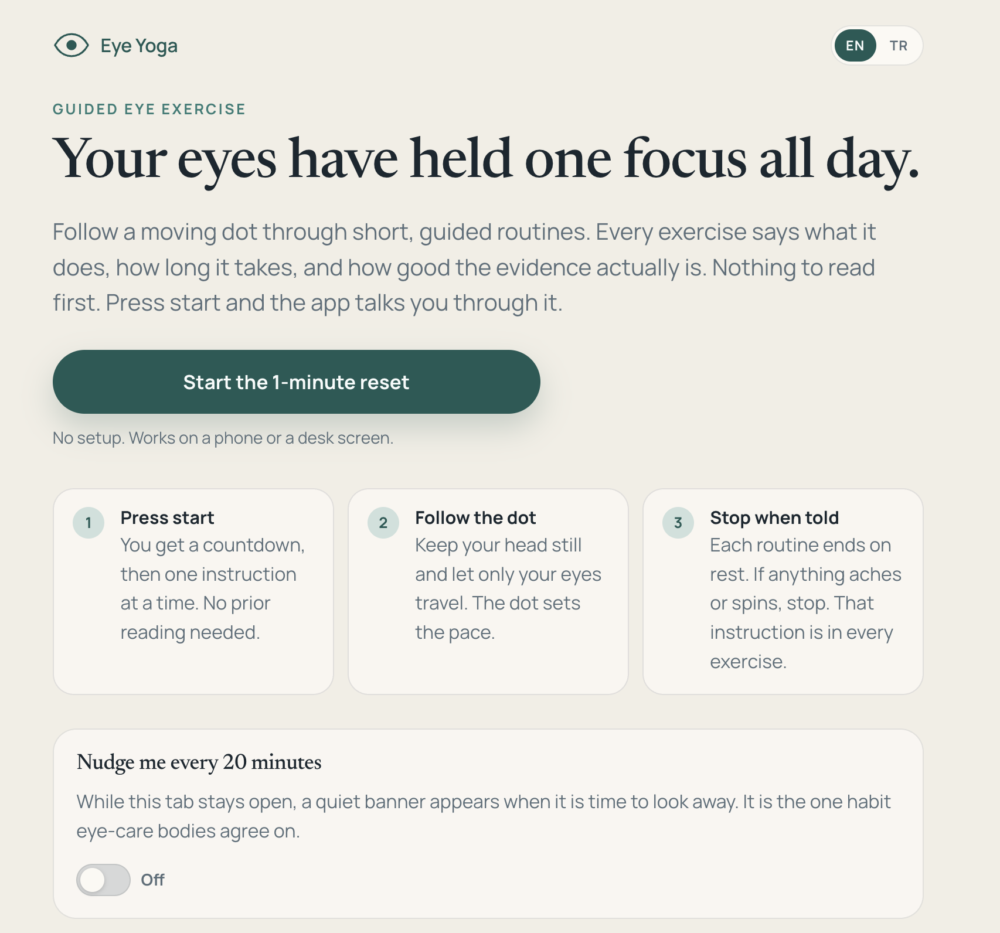
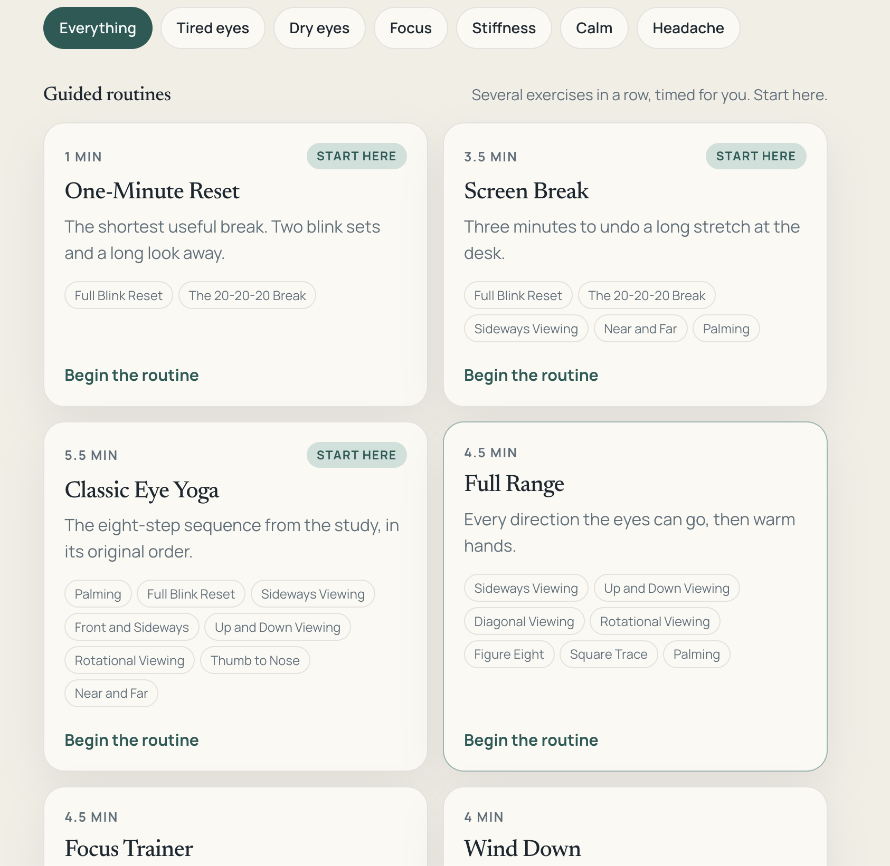
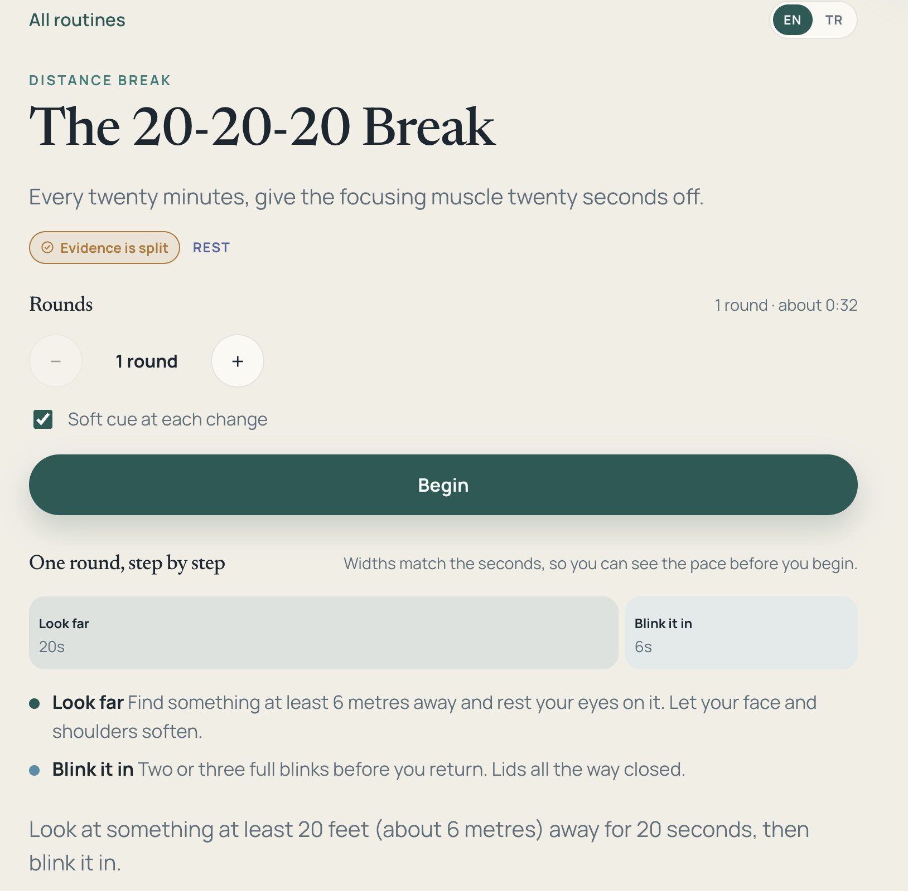
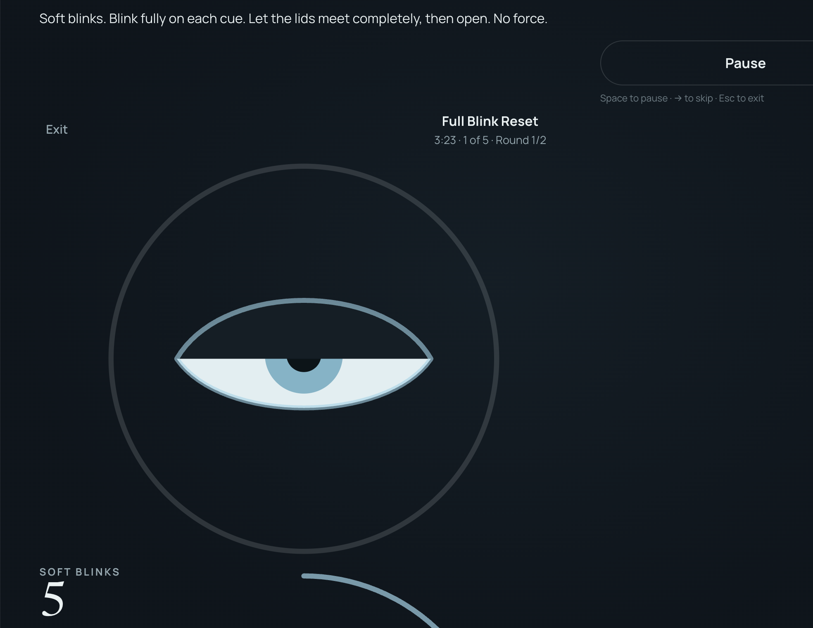

# Eye Yoga

Guided eye exercises for screen strain, focus, and eye mobility. Follow a moving dot, no counting or guesswork. English and Turkish.

Every exercise says what it is measured to do, and what it does not do. Eye exercises do not change a glasses prescription or cure short-sightedness.

Not medical advice. Stop if you feel dizzy, nauseous, or any eye pain, and see an eye doctor for sudden vision changes, flashes, or floaters.

## Features

- One-minute quick start straight from the home screen: no setup, no reading first
- 14 exercises and 6 routines, filterable by what you actually feel: tired eyes, dry eyes, focus, stiffness, calm, headache
- A guided audio reset on the home screen, in English and Turkish
- A moving target dot on a dark stage with faint guide paths, so following along needs no interpretation
- Distinct visuals per exercise type: smooth pursuit, jump-and-land saccades, blink prompts with animated lids, near-far depth rings, palming, and steady-gaze trataka
- Evidence badge on every exercise (trial, clinical, mixed, or traditional) with the study behind it linked
- Streak, session count, and total minutes to keep the habit going
- Soft tones per step kind, a rising triad at the end, and light haptics where supported
- Sound toggle and reduced-motion support
- Shareable URLs for a single exercise or routine (for example `/exercise/palming` or `/routine/desk`)
- Keyboard control during a session: space to pause, right arrow to skip a block, escape to exit
- Screen stays awake mid-session via the Wake Lock API

## Run it

```bash
npm install
npm run dev
```

Open [http://localhost:5173/eye-yoga/](http://localhost:5173/eye-yoga/).

## Checks

```bash
npm run typecheck   # tsc across app and scripts
npm run lint        # oxlint
npm run check:data  # exercise timings, EN/TR copy parity, path bounds
npm run build       # production build into dist/
```

`check:data` is worth running after touching anything in `src/data` or `src/i18n`. It verifies that every exercise has copy in both languages with matching step counts, that routines only reference known exercises within their round limits, and that all movement paths stay inside the stage.

## Screenshots








